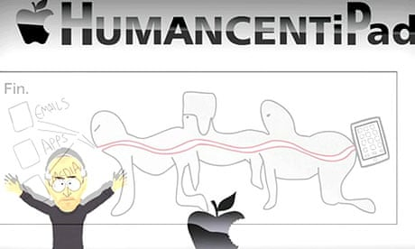
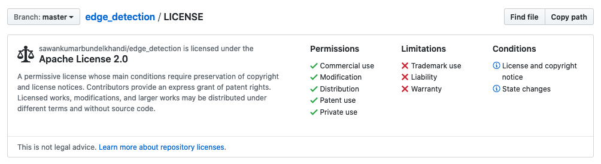
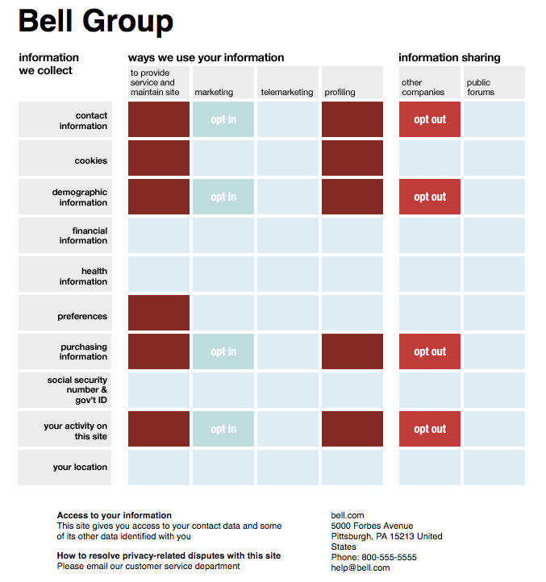
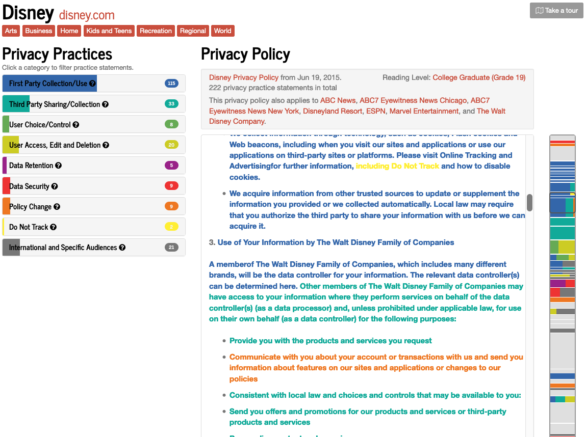

# Android Developer Challenge (#AndroidDevChallenge) - Submission Three
 
## Tell us what your idea is.
 
Perhaps one of the most common activities these days, is mindlessly agreeing to privacy policy. Most of the time the users do not read these terms simply because they do not have any other choice but to accept them. When this topic comes up, I could not help but think about [the fate of Kyle Broflovski of the South Park](https://www.theguardian.com/technology/blog/2011/apr/29/apple-tracking-south-park). He was chosen to take part in the experiment after he carelessly clicks on "I agree" without reading the new iTunes terms and conditions.
 

 
The app will simplify the terms and conditions or privacy policy documents. It will work like the Google Translate app. Users can copy and paste the terms directly into the app. They can also input the URL of a website with the terms. Then the app will present a simplified version of the input.
 
The output can be another text. This text can be a summary and much shorter than the original one, or it can be long but in simple English that everybody can understand. It is not a very good solution though, since the users should read another text at the end.
 
It can also look like the way that GitHub simplify the licenses on their repositories.

 
Moreover, the output can follow the study of researchers from Carnegie Mellon University to be like [a “nutrition label” for privacy](http://cups.cs.cmu.edu/soups/2009/proceedings/a4-kelley.pdf). The following image is a sample privacy nutrition for Bell Group.

 
My favorite one is what another group of researchers from Carnegie Mellon University, and the Center on Law and Information Policy at Fordham University, and the Center for Internet Society at Stanford University have been doing for [the Usable Privacy Policy Project](https://explore.usableprivacy.org/). The following is the Disney Privacy Policy that is manually identified and annotated by humans.

 
## Tell us how you plan on bringing it to life.
 
### The Timeline

- UI/UX Design: As I mentioned before the app can look very similar to Google Translate App. It can have three screens to request for simplification, history, and settings. I can formalize the design and user stories in 3 days.
 
- The App: The app will be written in flutter to be able to use on Android and iOS. Everything here is very simple and straightforward and it can be done in 3 weeks.
 
- AI: This will be the biggest part of the app. It will take 4 to 8 weeks. I will use TensorFlow based solutions from Google. I can break down this step into two major parts:
 
  - Dataset Preparation: I can use datasets from [the Usable Privacy Policy Project](https://www.usableprivacy.org/data), and [Text simplification data sets](https://cs.pomona.edu/~dkauchak/simplification/), and [Simple English Wikipedia](https://simple.wikipedia.org/wiki/Main_Page).
 
  - Training The Model: If possible I will use the available firebase [TensorFlow Text Classification](https://www.tensorflow.org/lite/models/text_classification/overview) or [AI Platform Data Labeling Service](https://cloud.google.com/ai-platform/data-labeling/docs/). I also have to convert the models into a compressed flat buffer ones with the TensorFlow Lite Converter.
 
 
  Then I can use Firebase [AutoML Vision Edge](https://firebase.google.com/docs/ml-kit/train-image-labeler) to host this model, and load them at run time with the iOS and Android SDKs. I will also bundle the model with the apps, so it will be immediately available on install. For this step I will consider 3 days, but it can be combined with other steps too.
 
  - Hosting the Models: I will host the TensorFlow Lite model on Firebase, so ML Kit keeps the users up to date with the latest version of the model. I will also bundle the model with the app, so it will be immediately available on install.
 
- Releasing the app: Mostly to prepare the store listing, including the app icons,  the screenshots, the descriptions and the rest. It will take 2 days.
 
As you can see these steps will roughly take 8 to 12 weeks. As I will use the remaining time to further improve the app or improve the model.
 
### Google’s help
 
The Google can help me with dataset preparation, training, and everything related to them. For instance how can I use the technique known as [transfer learning](https://www.tensorflow.org/lite/models/object_detection/overview) with [the Cloud Platform UI](https://cloud.google.com/vision/automl/object-detection/docs/edge-quickstart) to use a [starter model](https://www.tensorflow.org/lite/models/object_detection/overview#starter_model). Besides, I only have a MacBook pro, and I do not have access to a system with a good GPU for training. It would be great if I could be able to use Google AI Platform on GCP and Firebase to implement this project. Finally, Google can help me reach out too much more people, and that means better data, which ultimately translate to a better app.
 
## Tell us about you.
 
I have a bachelor’s degree in computer engineering and my master’s studies was on Informatics engineering. My thesis project was about biologically inspired computer vision, so I have a different (good) understanding on deep learning that was inspired by perception in the human visual system.
 
I started working at the software development companies, writing FoxPro and Visual Basic code, when I was a sophomore in high school. Professionally, I have more than 10 years of experience in software development. I have more than 5 years of experience in mobile development working on 7 Android and 3 iOS apps.
 
Currently I am the Mobile Team Lead at an international company in Europe. We are a team of 19 developers across all areas, 4 of whom are mobile developers. I am managing the mobile team and responsible for 4 projects which includes 7 applications. I am still enjoying writing mobile and backend codes every chance I get in the following areas: DevOps (Microsoft TFS, Git, Jenkins Automated UI Testing), Mobile Development (Flutter, IOS(SWIFT), Android(Kotlin, Java)), JavaScript (Node.js), Databases(SQL, NoSQL), Cloud Computing (Azure, Firebase, AWS), AI (TensorFlow, Image Processing (OpenCV)).
